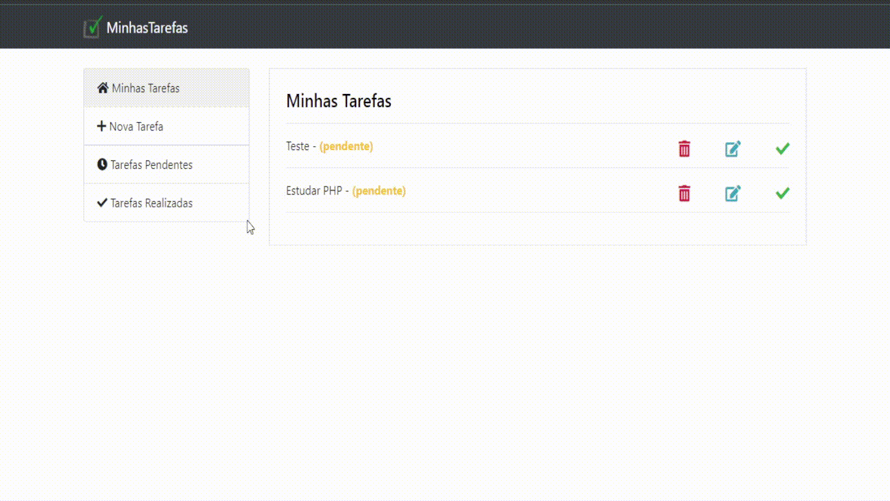

# MinhasTarefas - Um simples sistema de tarefas em PHP e MySQL
<div style="display: inline_block"><br>
  
  
  
  
  
  
  
 
</div>

## ➡️ Introdução

> Um Simples sistema de tarefas em PHP (POO) e MySQL, utilizando PDO.


## 🔎 Features

> ➕ Registre uma nova tarefa. <br/>👀 Consulte suas tarefas pendentes ou realizadas.<br/>✔️ Marque as que você já realizou ou que ainda estão pendentes.<br/>👤 Tenha uma conta própria e tenha tarefas apenas suas.

<br/><br/>

## 💾 Banco de Dados

<b>Importe o db_tarefas.sql para obter a estrutura do banco de dados necessário para a aplicação.</b><br/>

Pra fazer adicionar novos usuários, considere executar a seguinte query no seu banco de dados *:

```
INSERT INTO `tb_usuarios`(`NOME`, `EMAIL`, `SENHA`) VALUES ('NOME','EMAIL','SENHA')
```
<br/>
* Por padrão, o banco de dados já vem com o usuário <B>teste@teste.com</B> e senha <B>teste</B>


<br/><br/>

## 👁️ Preview:



