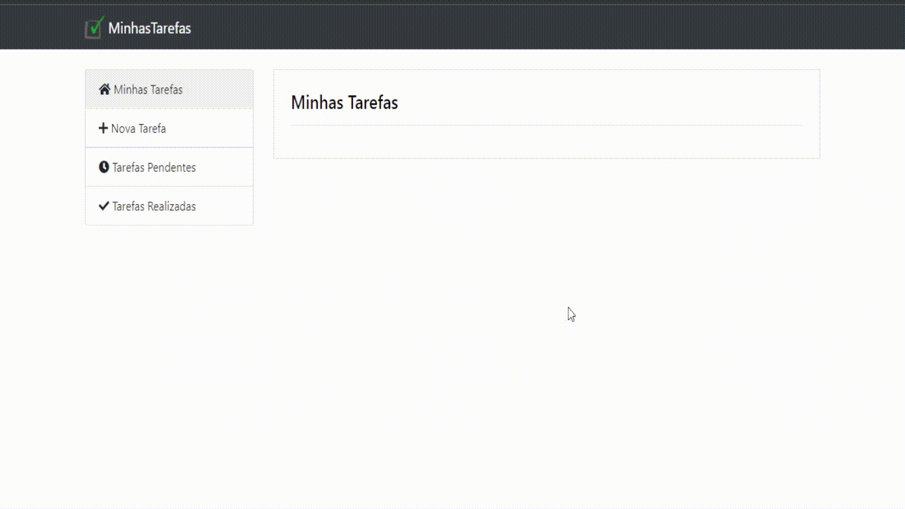

# MinhasTarefas - Um simples sistema de tarefas em PHP e MySQL

 
  
  
  
  
  

## ➡️ Introdução

> Um sistema de tarefas em PHP e MySQL, utilizando PDO.

## 🔎 Features

> 💸 Registre uma nova tarefa.  👀 Consulte suas tarefas pendentes ou realizadas. ✔️ Marque as que você já realizou. 
  
<a href="https://felipepaluco.github.io/Expense-Management-App/">Click here to check it out!</a>

## 🛠 Features planejadas:

> 📃 Criar a opção de colocar uma tarefa como pendente.

## 👁️ Preview:

